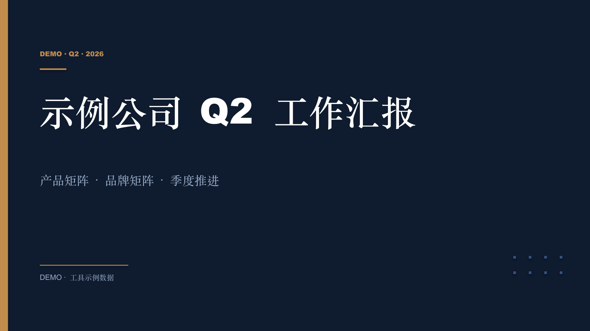
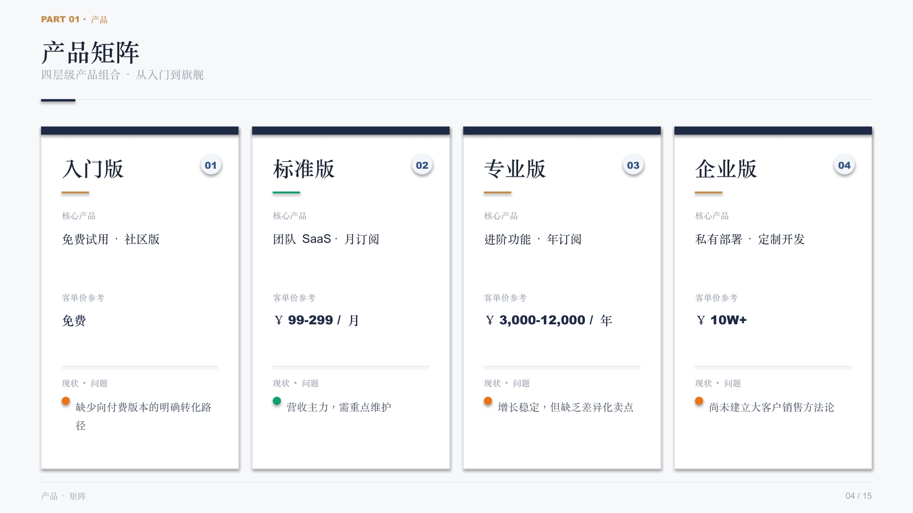
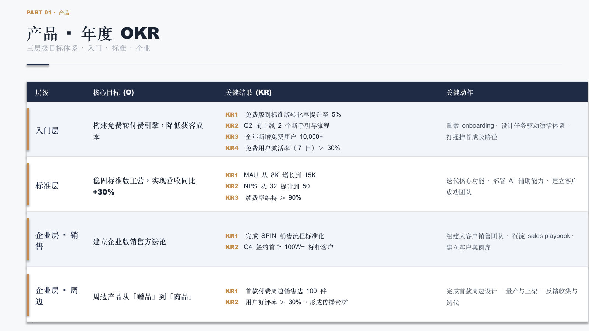
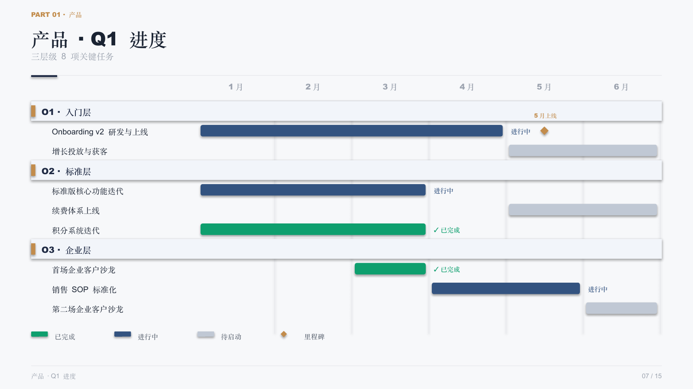
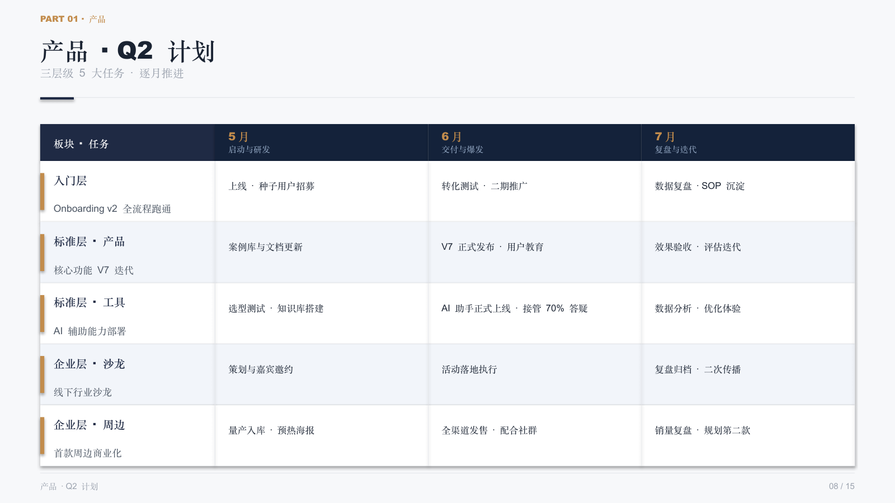

# PPT2PPT

把内容密集、emoji 凑色块的工作汇报 pptx,重新设计为沉稳商务风、可继续编辑、**有明确观点**的 pptx。



---

## 解决的张力

工作汇报场景有一个根本张力:

- **汇报人想要的**: 一份能让听众**当场听懂判断**的 PPT — 极少 bullet,每页一个观点
- **老板需要的**: 一份能**看到工作量**的 PPT — 全量任务、KR、数据,证明"我干了活"

PPT2PPT 把这个张力拆成三层解决:

| 层 | 解决什么 | 状态 |
|---|---|---|
| **v0 · 视觉层** | 信息密集的 pptx → 沉稳商务风的版式重排 | ✅ `redesign.py` |
| **v1 · 叙事层** | 描述性标题 → Action Title;三档语气适配场景 | ✅ Claude Code Skill `/rewrite-action-title` |
| **v2 · 信息密度层** | 一份输入 → 演讲面(6 页)+ 详情面(15 页),两面叙事一致 | ✅ Claude Code Skill `/rewrite-presentation` |

完整设计哲学: [docs/v1-design-philosophy.md](docs/v1-design-philosophy.md) · [docs/v2-roadmap.md](docs/v2-roadmap.md)

---

## 预览(详情面 v0 版式)

| 产品矩阵 | 年度 OKR |
|---|---|
|  |  |

| Q1 进度(真甘特图) | Q2 计划 |
|---|---|
|  |  |

> 截图来自 LibreOffice 渲染,中文回退到了仿宋字体;用 PowerPoint / Keynote 打开是雅黑 / 苹方。

---

## 设计原则

- **可编辑优先** — 输出真矢量 pptx,不是图片化导出。打开后可继续在 PowerPoint / Keynote 改字 / 调位置。
- **重排版而非堆模板** — 解析原文 → 提炼为结构化字段 → 按汇报场景重组信息架构 → 程序化生成。
- **克制** — 纯文字内容不强行塞插图;emoji 假色块替换为真甘特图;表格做行级分层。
- **每页一个观点(v1)** — Action Title 替代描述性标题。让动词 / 判断 / 数字进入标题。
- **力度可调(v1)** — 同一份事实有 internal / balanced / external 三种语气版本。
- **两面叙事一致(v2)** — 演讲面是详情面的精炼摘要,不是独立创作。事实层禁止矛盾。

---

## 快速开始

```bash
python3 -m venv .venv
.venv/bin/pip install -r requirements.txt
```

仓库自带的 `content.py` 是一份虚构示例数据。把里面字段换成你自己的内容即可。

### 三种产物

```bash
# 1. 详情面(15 页 · 工作量证明)
.venv/bin/python redesign.py
# → output.pptx

# 2. 演讲面(6 页 · 现场叙事)
.venv/bin/python redesign_presentation.py
# → output-presentation.pptx
```

汇报现场翻演讲面,被问细节切到详情面。或者会前发演讲面、会后发详情面。

---

## v2 · 双 deck Skill 用法

`/rewrite-presentation` 把 v1 详情面提炼为 6 页演讲骨架(每页 1 观点 + ≤ 3 支撑)。

```
/rewrite-presentation balanced     # 默认 · 跨部门 / 对上级
/rewrite-presentation internal     # 部门内部 / 复盘会
/rewrite-presentation external     # 投资人 / 客户 / 媒体
```

**输入**: `content_action_<tone>.py`(若已跑过 v1)或 `content.py`
**输出**: `content_presentation_<tone>.py`,审计追加到 `docs/audit.md`

切换数据 → 渲染演讲面:

```bash
cp content_presentation_balanced.py content_presentation.py
.venv/bin/python redesign_presentation.py
# → output-presentation.pptx
```

skill 实现:
- [`prompts/rewrite_presentation.md`](prompts/rewrite_presentation.md) — 演讲面摘要规则 + 6 页 schema + 字数硬约束
- [`.claude/commands/rewrite-presentation.md`](.claude/commands/rewrite-presentation.md) — slash command 入口

演讲面 6 页骨架: 封面 / 产品现状 / 产品节奏 / 品牌现状 / 品牌节奏 / 结尾。砍掉了详情面的目录、章节分隔、矩阵、OKR、甘特、账号矩阵 — 这些归详情面。

---

## v1 · Action Title Skill 用法

```
/rewrite-action-title balanced     # 默认
/rewrite-action-title internal     # 尖锐
/rewrite-action-title external     # 建设性
```

**输入**: `content.py`
**输出**: `content_action_<tone>.py`,审计追加到 `docs/audit.md`

切换数据 → 渲染详情面:

```bash
cp content_action_balanced.py content.py
.venv/bin/python redesign.py
```

skill 实现:
- [`prompts/rewrite_action_title.md`](prompts/rewrite_action_title.md) — 单一真相源 prompt(规则 + 词典 + 红线)
- [`.claude/commands/rewrite-action-title.md`](.claude/commands/rewrite-action-title.md) — slash command 入口

三档对比效果见 [docs/v1-design-philosophy.md](docs/v1-design-philosophy.md) 末尾的对照表。

---

## 设计系统

| 用途 | 颜色 |
|---|---|
| 主背景(封面 / 章节 / 结尾) | `#0F1B2E` 极深蓝 |
| 内容页背景 | `#F7F8FA` 浅灰 |
| 卡片底 | `#FFFFFF` |
| 主色 / 数据强调 | `#1F2A44` 深蓝 |
| 暖金点缀(标签 / 装饰条 / 序号) | `#C28C4C` |
| 状态色 | `#0E9F6E` 完成 · `#33537E` 进行 · `#C0C8D4` 待启动 · `#E97316` 警示 |

字体: `Microsoft YaHei`(跨平台时回退到苹方 / 思源黑)。

---

## 页面类型

### 详情面(15 页 · `redesign.py`)

```
1  封面            8  产品 · Q2 计划
2  目录            9  PART 02 · 品牌
3  PART 01 · 产品  10 品牌矩阵(4 层级 + 子项)
4  产品矩阵        11 品牌 · 当前问题
5  产品 · 当前问题 12 品牌 · 年度 OKR
6  产品 · 年度 OKR 13 品牌 · Q1 进度(9 张账号卡)
7  产品 · Q1 甘特  14 品牌 · Q2 计划
                   15 结尾
```

### 演讲面(6 页 · `redesign_presentation.py`)

```
1  封面               4  品牌现状(传播没方法论)
2  产品现状(三个卡点) 5  品牌节奏(Q2 三链路)
3  产品节奏(Q2 三件事)6  结尾
```

每页 1 观点 + ≤ 3 支撑。

---

## 文件结构

### 数据层
- `content.py` — 当前在用的详情面数据(可被 cp 切换)
- `content_action.py` — v1 手写 master
- `content_action_<tone>.py` — v1 skill 自动产出三档
- `content_presentation.py` — v2 手写 master(6 页)
- `content_presentation_<tone>.py` — v2 skill 自动产出三档
- `content_real.py` — 本地真实数据(gitignored)

### 渲染层
- `redesign.py` — 详情面渲染(12 种页型)
- `redesign_presentation.py` — 演讲面渲染(复用 v1 utils + 新增 `slide_keypoint` / `slide_milestone`)

### Skill 层
- `prompts/rewrite_action_title.md` · `prompts/rewrite_presentation.md`
- `.claude/commands/rewrite-action-title.md` · `.claude/commands/rewrite-presentation.md`

### 文档
- `docs/v1-design-philosophy.md` — v1 完整设计哲学
- `docs/v2-roadmap.md` — v2 路线图与设计决策
- `docs/audit.md` — 每次 skill 重写的审计日志
- `docs/tone-variants.md` — 三档语气对比设计笔记

---

## 已知限制

- LibreOffice 转 PDF 时中文会回退到非雅黑字体;用 PowerPoint / Keynote 打开是正常的雅黑 / 苹方。
- 当前内容硬编码在 `content.py`,换 PPT 需要重写数据(自动解析 pptx → content.py 是 v3 议题)。
- 演讲面字段有字数硬约束(`lane.task ≤ 14 中文字`);手写或 skill 输出超长会在版式里被截断换行。

---

## 路线图

- [x] **v0** — 视觉层重排(redesign.py · 沉稳商务风 · 12 种页型)
- [x] **v1** — 叙事层重写(Action Title + B 修复 + tone 三档 + Claude Code Skill)
- [x] **v2** — 信息密度层(演讲面 6 页 + 详情面 15 页 · `/rewrite-presentation` skill)
- [ ] **v3** — 输入端(自动解析任意 pptx → content.py · 免去手写)
- [ ] **v4+** — 多主题 / CLI 封装 / 跨场景

---

## 协议

MIT
